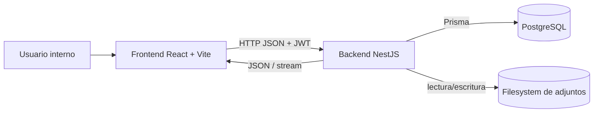
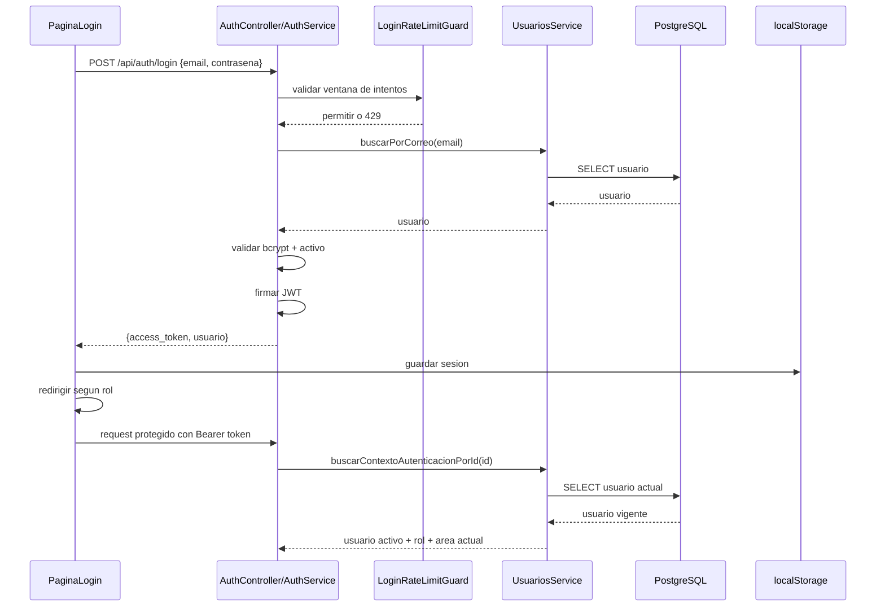
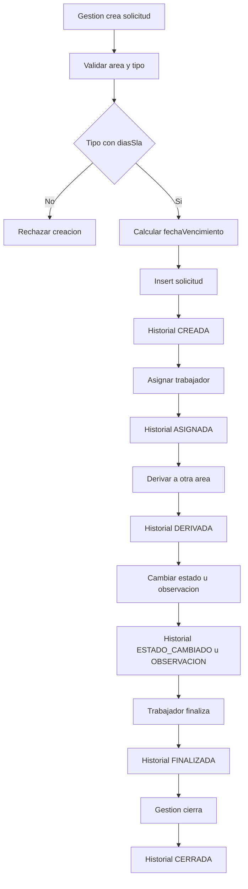
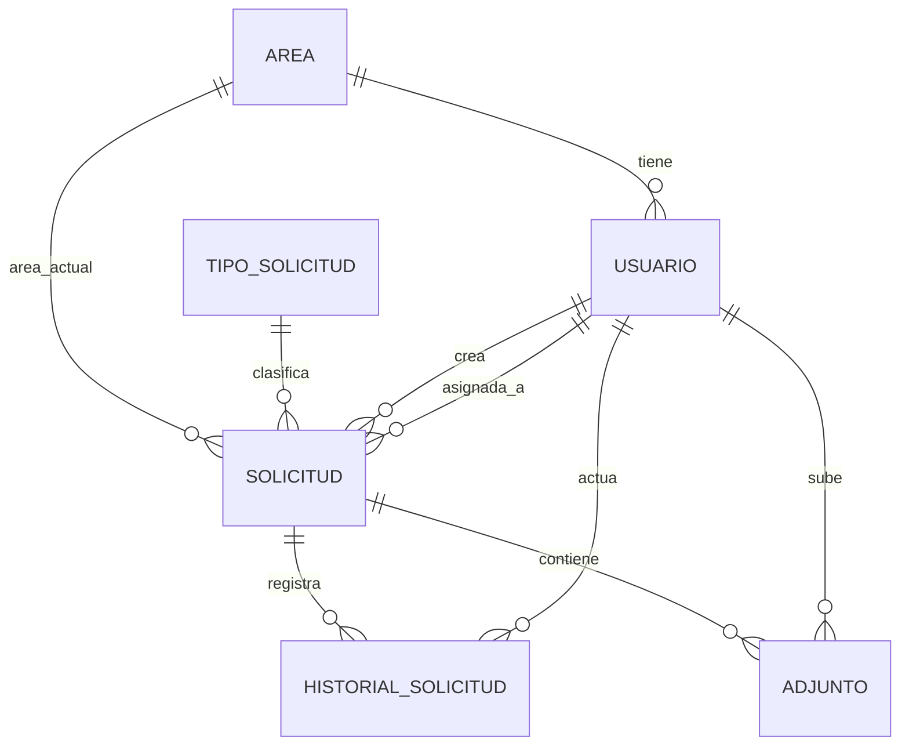
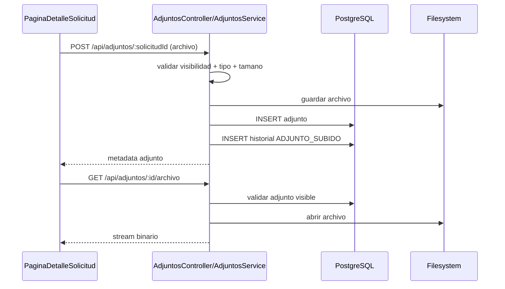

# Documentacion Tecnica del Sistema de Trazabilidad Municipal

## 1. Portada / identificacion del documento

| Campo | Valor |
| --- | --- |
| Nombre del sistema | Trazabilidad Municipal de Solicitudes |
| Objetivo del documento | Describir la construccion actual del sistema, sus modulos, flujos de informacion, entidades, endpoints, pantallas y reglas de negocio |
| Fecha | 2026-04-23 |
| Version del sistema | 1.0.0 |
| Version del documento | 1.1 |
| Stack tecnologico | Backend: NestJS 11, Prisma 6, PostgreSQL, JWT, Passport, bcrypt, multer. Frontend: React 19, Vite 7, TypeScript, React Router 7, Ant Design 5, utilidades CSS con Tailwind |

## 2. Descripcion general del sistema

### 2.1 Problema que resuelve

El sistema centraliza la trazabilidad interna de solicitudes municipales. Permite registrar solicitudes, asignarlas a trabajadores, derivarlas entre areas, cambiar su estado, adjuntar archivos y consultar reportes operativos.

### 2.2 Objetivo principal

Mantener control del ciclo de vida de una solicitud interna o administrativa, con visibilidad por rol, historial de acciones y soporte para adjuntos y reportes.

### 2.3 Usuarios del sistema

| Rol | Descripcion operativa |
| --- | --- |
| `ENCARGADO` | Rol de gestion con acceso a dashboard, catalogos, usuarios, reportes y operaciones de gestion sobre solicitudes |
| `REEMPLAZO` | Rol de gestion con permisos equivalentes al encargado en la implementacion actual |
| `TRABAJADOR` | Rol operativo enfocado en ver solicitudes visibles para su area o asignadas, agregar observaciones, cambiar ciertos estados, finalizar y manipular adjuntos |

### 2.4 Modulos principales

- Autenticacion y sesion
- Areas
- Usuarios
- Tipos de solicitud
- Solicitudes
- Historial de solicitudes
- Adjuntos
- Reportes y dashboard

### 2.5 Alcance actual

El sistema implementa:

- Login con JWT
- Revalidacion del usuario autenticado en cada request protegida
- Rate limit local para login
- Gestion de usuarios, areas y tipos de solicitud
- Registro y seguimiento de solicitudes
- Calculo automatico de `fechaVencimiento` desde `diasSla`
- Historial por solicitud
- Adjuntos almacenados localmente
- Dashboard y reportes agregados
- Restriccion de acceso por rol

No se observa implementado actualmente:

- Recuperacion de contrasena
- Refresh token
- Logout backend
- API publica para eliminacion de solicitudes
- Notificaciones, correos o tareas programadas
- Filtros de reportes expuestos en la UI
- UI dedicada para el endpoint global de historial

## 3. Arquitectura general

### 3.1 Arquitectura de alto nivel

La solucion sigue una arquitectura cliente-servidor:

- El frontend React consume una API REST bajo `/api`.
- El backend NestJS concentra controladores, validacion, reglas de negocio y acceso a datos.
- Prisma actua como capa de acceso a PostgreSQL.
- Los adjuntos se guardan en el filesystem local del backend.

### 3.2 Relacion entre frontend, backend, base de datos y almacenamiento de adjuntos

- Frontend:
  - Gestiona navegacion, formularios, tablas y sesion local.
  - Consume la API via `fetch`.
- Backend:
  - Valida entrada.
  - Aplica guards de JWT y roles.
  - Ejecuta logica de negocio.
  - Persiste entidades y historial.
- Base de datos PostgreSQL:
  - Almacena usuarios, areas, tipos, solicitudes, historial y metadatos de adjuntos.
- Almacenamiento de adjuntos:
  - Guarda el archivo fisico en `backend/uploads/adjuntos` o en `ADJUNTOS_DIR` si se configura.

### 3.3 Responsabilidades de cada capa

| Capa | Responsabilidades |
| --- | --- |
| Frontend | Login, proteccion de rutas, formularios, tablas, consumo de API, manejo de estado de carga/error, descarga y visualizacion de adjuntos |
| API REST | Exponer endpoints por modulo, autenticar, autorizar, validar DTOs, devolver respuestas JSON o archivos |
| Servicios backend | Aplicar reglas de negocio, controlar visibilidad por rol, generar historial, construir filtros de consulta |
| Prisma | Ejecutar consultas y transacciones sobre PostgreSQL |
| PostgreSQL | Persistencia de dominio |
| Filesystem | Persistencia fisica de adjuntos |

### 3.4 Flujo general de comunicacion entre frontend y backend

1. El usuario interactua con una pagina React.
2. La pagina usa servicios frontend y hooks (`useConsulta`, `useMutacion`).
3. El cliente API envia la peticion a `VITE_API_URL` con el token JWT si existe.
4. El backend aplica guards y validacion global.
5. El controlador delega al servicio.
6. El servicio usa Prisma y, si aplica, transacciones.
7. El backend responde JSON o archivo.
8. El frontend actualiza la UI, refetch o navega segun el caso.

## 4. Flujo detallado de la informacion

### 4.1 Login

- Quien inicia la accion:
  - Cualquier usuario interno con credenciales.
- Pantalla o endpoint:
  - UI: `frontend/src/paginas/login/PaginaLogin.tsx`
  - API: `POST /api/auth/login`
- Datos de entrada:
  - `email`
  - `contrasena`
- Validaciones aplicadas:
  - Frontend: campos requeridos.
  - Backend DTO: email valido y contrasena entre 8 y 128 caracteres.
  - Guard adicional: rate limit local en memoria por IP y correo.
  - Servicio: usuario existente, activo y contrasena valida.
- Servicio que procesa la logica:
  - `AuthService.iniciarSesion`
- Que se guarda en base de datos:
  - Nada.
- Respuesta al frontend:
  - `access_token`
  - objeto `usuario` con `id`, `correo`, `rut`, `rol`, `areaId`, `nombres`, `apellidos`
- Como se refleja en la UI:
  - Se guarda la sesion en `localStorage`.
  - Se navega a `/dashboard` para gestion o `/solicitudes` para trabajador.
- Registros de historial:
  - No se genera historial.

### 4.2 Creacion de usuario

- Quien inicia la accion:
  - `ENCARGADO` o `REEMPLAZO`.
- Pantalla o endpoint:
  - UI: `PaginaUsuarios` mediante modal `FormularioUsuario`
  - API: `POST /api/usuarios`
- Datos de entrada:
  - nombres, apellidos, rut, email, contrasena, telefono, rol, areaId, activo
- Validaciones aplicadas:
  - Frontend: longitud, formato de correo, RUT valido, contrasena requerida en modo crear.
  - Backend DTO: reglas de longitud, `rol` enum, `areaId` entero.
  - Servicio: verifica existencia del area.
  - Prisma: unicidad de `email` y `rut`.
- Servicio:
  - `UsuariosService.crear`
- Que se guarda:
  - Registro en tabla `usuarios`
  - La contrasena se guarda hasheada con bcrypt.
- Respuesta:
  - Usuario saneado sin `contrasena`, con `area` y `totalSolicitudes`.
- UI:
  - Se cierra el modal y se recarga la tabla.
  - Si hay conflicto de correo o RUT, el formulario muestra error.
- Historial:
  - No genera historial en la implementacion actual.

### 4.3 Creacion de area

- Quien inicia la accion:
  - `ENCARGADO` o `REEMPLAZO`.
- Pantalla o endpoint:
  - UI: `PaginaAreas`
  - API: `POST /api/areas`
- Datos de entrada:
  - nombre, descripcion, activo
- Validaciones:
  - Frontend: nombre requerido.
  - Backend DTO: nombre entre 2 y 120 caracteres, descripcion opcional, activo opcional.
  - Prisma: `nombre` unico.
- Servicio:
  - `AreasService.crear`
- Persistencia:
  - Inserta un registro en `areas`.
- Respuesta:
  - Area creada.
- UI:
  - Refetch de la lista.
- Historial:
  - No genera historial.

### 4.4 Creacion de tipo de solicitud

- Quien inicia la accion:
  - `ENCARGADO` o `REEMPLAZO`.
- Pantalla o endpoint:
  - UI: `PaginaTiposSolicitud`
  - API: `POST /api/tipos-solicitud`
- Datos de entrada:
  - nombre, descripcion, diasSla, activo
- Validaciones:
  - Frontend: nombre requerido, `diasSla` opcional.
  - Backend DTO: nombre 2..120, descripcion opcional, `diasSla` entre 1 y 365.
  - Prisma: `nombre` unico.
- Servicio:
  - `TiposSolicitudService.crear`
- Persistencia:
  - Inserta un registro en `tipos_solicitud`.
- Respuesta:
  - Tipo creado.
- UI:
  - Refetch de la tabla.
- Historial:
  - No genera historial.
- Observacion:
  - Aunque `diasSla` es opcional a nivel de catalogo, en la implementacion actual solo se pueden crear solicitudes con tipos que lo tengan configurado, porque la fecha de vencimiento se calcula a partir de ese valor.

### 4.5 Creacion de solicitud

- Quien inicia la accion:
  - `ENCARGADO` o `REEMPLAZO`.
- Pantalla o endpoint:
  - UI: `PaginaSolicitudes`, modal `FormularioSolicitud`
  - API: `POST /api/solicitudes`
- Datos de entrada:
  - titulo, descripcion, prioridad, areaActualId, tipoSolicitudId, asignadoAId opcional, comentario opcional
- Validaciones:
  - Frontend: reglas de longitud, seleccion de area y tipo, y texto informativo con vencimiento estimado segun el `diasSla` del tipo seleccionado.
  - Backend DTO: titulo 5..200, descripcion 10..5000, ids enteros.
  - Servicio:
    - usuario autenticado debe seguir activo
    - area debe existir y estar activa
    - tipo de solicitud debe existir y estar activo
    - el tipo de solicitud debe tener `diasSla` configurado
    - si hay asignado, debe ser `TRABAJADOR` y pertenecer al area seleccionada
    - `fechaVencimiento` se calcula como fecha actual + `diasSla`
- Servicio:
  - `SolicitudesService.crear`
- Persistencia:
  - Inserta registro en `solicitudes`
  - Guarda `fechaVencimiento` calculada automaticamente
  - Inserta entrada de historial con accion `CREADA`
- Respuesta:
  - Devuelve el detalle completo de la solicitud recien creada.
- UI:
  - El formulario no solicita fecha manual.
  - Se muestra una leyenda con la fecha estimada si el tipo seleccionado tiene SLA.
  - Se cierra el modal, se actualiza la lista y se navega al detalle de la solicitud.
- Historial:
  - Si, accion `CREADA` con estado destino, area destino, asignado destino y comentario inicial si se ingreso.

### 4.6 Asignacion de solicitud

- Quien inicia la accion:
  - `ENCARGADO` o `REEMPLAZO`.
- Pantalla o endpoint:
  - UI: `PaginaDetalleSolicitud`, accion `asignar`
  - API: `PATCH /api/solicitudes/:id/asignar`
- Datos de entrada:
  - `asignadoAId`, `comentario` opcional
- Validaciones:
  - DTO: `asignadoAId` entero.
  - Servicio:
    - solicitud activa existente
    - actor activo
    - trabajador destino activo y del area actual
    - la solicitud no debe estar cerrada
    - no puede asignarse al mismo trabajador actual
- Servicio:
  - `SolicitudesService.asignarSolicitud`
- Persistencia:
  - Actualiza `asignadoAId`
  - Inserta historial `ASIGNADA`
- Respuesta:
  - Detalle actualizado de la solicitud
- UI:
  - Se cierra el modal y se refresca el detalle.
- Historial:
  - Si, con `asignadoOrigenId`, `asignadoDestinoId` y comentario.

### 4.7 Derivacion de solicitud

- Quien inicia la accion:
  - `ENCARGADO` o `REEMPLAZO`.
- Pantalla o endpoint:
  - UI: `PaginaDetalleSolicitud`, accion `derivar`
  - API: `PATCH /api/solicitudes/:id/derivar`
- Datos de entrada:
  - `areaDestinoId`, `asignadoAId`, comentario opcional
- Validaciones:
  - DTO: ambos ids enteros.
  - Servicio:
    - solicitud activa existente
    - actor activo
    - area destino activa
    - trabajador destino activo, rol `TRABAJADOR` y perteneciente al area destino
    - la solicitud no debe estar cerrada
    - el area destino debe ser distinta del area actual
- Servicio:
  - `SolicitudesService.derivarSolicitudAArea`
- Persistencia:
  - Actualiza `areaActualId`, `asignadoAId` y `estado = DERIVADA`
  - Inserta historial `DERIVADA`
- Respuesta:
  - Detalle actualizado
- UI:
  - Refetch del detalle y del historial embebido.
- Historial:
  - Si, con area origen, area destino, asignado origen, asignado destino y cambio de estado a `DERIVADA`.

### 4.8 Cambio de estado

- Quien inicia la accion:
  - `ENCARGADO`, `REEMPLAZO` o `TRABAJADOR` asignado.
- Pantalla o endpoint:
  - UI: `PaginaDetalleSolicitud`, accion `estado`
  - API: `PATCH /api/solicitudes/:id/estado`
- Datos de entrada:
  - `estado`, comentario opcional
- Validaciones:
  - DTO: `estado` debe ser enum valido.
  - Servicio:
    - solicitud activa existente
    - actor activo
    - si es trabajador, solo el asignado puede operar
    - no puede usar `CERRADA`, `DERIVADA` ni `VENCIDA` por este endpoint
    - un trabajador no puede reabrir una solicitud ya finalizada
    - algunos estados requieren trabajador asignado
    - no puede repetirse el mismo estado
- Servicio:
  - `SolicitudesService.cambiarEstadoSolicitud`
- Persistencia:
  - Actualiza `estado`
  - Inserta historial `ESTADO_CAMBIADO` o `FINALIZADA` si el destino es `FINALIZADA`
- Respuesta:
  - Detalle actualizado
- UI:
  - Se recarga el detalle.
- Historial:
  - Si, con estado origen, estado destino y comentario.

### 4.9 Finalizacion

- Quien inicia la accion:
  - `TRABAJADOR` asignado.
- Pantalla o endpoint:
  - UI: `PaginaDetalleSolicitud`, accion `finalizar`
  - API: `PATCH /api/solicitudes/:id/finalizar`
- Datos de entrada:
  - comentario opcional
- Validaciones:
  - Servicio:
    - solicitud activa existente
    - actor activo
    - solo trabajador asignado
    - la solicitud no debe estar cerrada
    - debe existir asignacion
    - no puede estar ya finalizada
- Servicio:
  - `SolicitudesService.finalizarSolicitud`
- Persistencia:
  - `estado = FINALIZADA`
  - historial `FINALIZADA`
- Respuesta:
  - Detalle actualizado
- UI:
  - El detalle pasa a estado finalizado y el trabajador ya no puede seguir usando todas las acciones.
- Historial:
  - Si.

### 4.10 Cierre de solicitud

- Quien inicia la accion:
  - `ENCARGADO` o `REEMPLAZO`.
- Pantalla o endpoint:
  - UI: `PaginaDetalleSolicitud`, accion `cerrar`
  - API: `PATCH /api/solicitudes/:id/cerrar`
- Datos de entrada:
  - comentario opcional
- Validaciones:
  - Servicio:
    - solicitud activa
    - actor activo
    - la solicitud debe estar en estado `FINALIZADA`
    - no puede estar ya `CERRADA`
- Servicio:
  - `SolicitudesService.cerrarSolicitud`
- Persistencia:
  - `estado = CERRADA`
  - `fechaCierre = now`
  - historial `CERRADA`
- Respuesta:
  - Detalle actualizado
- UI:
  - El detalle refleja cierre y fecha de cierre.
- Historial:
  - Si.

### 4.11 Subida de adjuntos

- Quien inicia la accion:
  - Cualquier rol autenticado con visibilidad sobre la solicitud.
- Pantalla o endpoint:
  - UI: `PaginaDetalleSolicitud`, seccion Adjuntos
  - API: `POST /api/adjuntos/:solicitudId`
- Datos de entrada:
  - Archivo `multipart/form-data` con campo `archivo`
- Validaciones:
  - Frontend: extension permitida y maximo 10 MB.
  - Backend multer:
    - `mimetype` permitido
    - limite de 10 MB
  - Servicio:
    - solicitud visible para el usuario
    - archivo presente
- Servicio:
  - `AdjuntosService.subirAdjunto`
- Persistencia:
  - Guarda archivo fisico en disco
  - Inserta metadata en `adjuntos`
  - Inserta historial `ADJUNTO_SUBIDO`
- Respuesta:
  - Adjunto creado con informacion del usuario que lo subio.
- UI:
  - Recarga lista de adjuntos e historial del detalle.
- Historial:
  - Si, con comentario `"Adjunto subido: <nombreOriginal>"`.

### 4.12 Descarga o visualizacion de adjuntos

- Quien inicia la accion:
  - Cualquier rol con visibilidad sobre la solicitud.
- Pantalla o endpoint:
  - UI: `PaginaDetalleSolicitud`, botones Ver y Descargar
  - API: `GET /api/adjuntos/:id/archivo`
- Datos de entrada:
  - `id` del adjunto
  - query `descargar=true` si corresponde
- Validaciones:
  - Servicio:
    - adjunto visible
    - archivo fisico accesible
- Servicio:
  - `AdjuntosService.obtenerArchivoAdjunto`
- Persistencia:
  - No hay escritura.
- Respuesta:
  - Stream binario con `Content-Type` y `Content-Disposition`.
- UI:
  - `Ver` abre blob URL en nueva pestana.
  - `Descargar` crea un link temporal y descarga el archivo.
- Historial:
  - No genera historial.

### 4.13 Generacion de reportes

- Quien inicia la accion:
  - `ENCARGADO` o `REEMPLAZO`.
- Pantalla o endpoint:
  - UI: `PaginaDashboard` y `PaginaReportes`
  - API:
    - `GET /api/reportes/resumen-general`
    - `GET /api/reportes/solicitudes-por-estado`
    - `GET /api/reportes/solicitudes-por-area`
    - `GET /api/reportes/carga-por-trabajador`
    - `GET /api/reportes/tiempo-promedio-respuesta`
    - `GET /api/reportes/solicitudes-vencidas`
    - `GET /api/reportes/solicitudes-por-tipo`
- Datos de entrada:
  - Actualmente la UI llama sin filtros.
  - La API soporta filtros opcionales: `fechaDesde`, `fechaHasta`, `areaId`, `trabajadorId`, `tipoSolicitudId`.
- Validaciones:
  - DTO de reportes valida fechas e ids enteros positivos.
  - Servicio valida que `fechaDesde <= fechaHasta`.
- Servicio:
  - `ReportesService`
- Persistencia:
  - No hay escritura.
- Respuesta:
  - Objetos agregados, listas por dimension y calculos de atraso/promedios.
- UI:
  - Dashboard muestra tarjetas, top areas, top tipos, carga de trabajadores y alertas.
  - PaginaReportes muestra tablas detalladas.
- Historial:
  - No genera historial.

## 5. Modelo de dominio

### 5.1 Entidades principales

| Entidad | Proposito |
| --- | --- |
| Area | Catalogo de unidades municipales. Agrupa usuarios y representa el area actual de una solicitud |
| Usuario | Actor interno autenticado que opera el sistema |
| TipoSolicitud | Catalogo de clasificacion de solicitudes, con SLA configurable para calcular vencimiento |
| Solicitud | Entidad central del negocio. Representa el expediente o requerimiento a seguir |
| HistorialSolicitud | Registro de trazabilidad de acciones sobre una solicitud |
| Adjunto | Metadata de archivos asociados a una solicitud |

### 5.2 Relaciones entre entidades

- Un `Area` tiene muchos `Usuario`.
- Un `Area` puede ser area actual de muchas `Solicitud`.
- Un `TipoSolicitud` clasifica muchas `Solicitud`.
- Un `Usuario` crea muchas `Solicitud`.
- Un `Usuario` puede estar asignado a muchas `Solicitud`.
- Una `Solicitud` tiene muchas entradas de `HistorialSolicitud`.
- Una `Solicitud` tiene muchos `Adjunto`.
- Un `Adjunto` puede estar asociado opcionalmente al usuario que lo subio.

### 5.3 Enums del dominio

| Enum | Valores |
| --- | --- |
| `RolUsuario` | `ENCARGADO`, `REEMPLAZO`, `TRABAJADOR` |
| `EstadoSolicitud` | `INGRESADA`, `DERIVADA`, `EN_PROCESO`, `PENDIENTE_INFORMACION`, `FINALIZADA`, `CERRADA`, `VENCIDA` |
| `PrioridadSolicitud` | `BAJA`, `MEDIA`, `ALTA`, `URGENTE` |
| `AccionHistorialSolicitud` | `CREADA`, `ASIGNADA`, `DESASIGNADA`, `DERIVADA`, `ESTADO_CAMBIADO`, `OBSERVACION`, `ADJUNTO_SUBIDO`, `ADJUNTO_ELIMINADO`, `FINALIZADA`, `CERRADA`, `ELIMINADA` |

### 5.4 Reglas de negocio por entidad

#### Area

- Debe tener nombre unico.
- Puede estar activa o inactiva.
- No se elimina si tiene usuarios asignados.

#### Usuario

- Debe tener correo y RUT unicos.
- Debe pertenecer a un area.
- Tiene bandera `activo`.
- La contrasena se almacena hasheada.

#### Tipo de solicitud

- Debe tener nombre unico.
- Puede tener `diasSla` opcional.
- Puede estar activo o inactivo.
- En la implementacion actual, si se usara para crear solicitudes, debe tener `diasSla` informado.

#### Solicitud

- La crean roles de gestion.
- Tiene fecha de vencimiento obligatoria en base de datos.
- La fecha de vencimiento se calcula automaticamente al crear, usando `diasSla` del tipo seleccionado.
- Puede tener trabajador asignado o no.
- `VENCIDA` no se persiste automaticamente como actualizacion de base; se presenta como estado calculado si la fecha vencio y no hay cierre.
- Soporta eliminacion logica por `eliminadoEn`, aunque no hay endpoint publico expuesto para esa operacion.

#### HistorialSolicitud

- Es el rastro de auditoria funcional.
- Se inserta en creacion, asignacion, derivacion, cambios de estado, observaciones, finalizacion, cierre y operaciones con adjuntos.

#### Adjunto

- Se asocia a una solicitud.
- Tiene archivo fisico y metadata.
- Un trabajador solo puede eliminar adjuntos que haya subido el mismo.

## 6. Modelo de base de datos

### 6.1 Tablas principales

| Tabla | Entidad |
| --- | --- |
| `areas` | Area |
| `usuarios` | Usuario |
| `tipos_solicitud` | TipoSolicitud |
| `solicitudes` | Solicitud |
| `historial_solicitudes` | HistorialSolicitud |
| `adjuntos` | Adjunto |

### 6.2 Campos importantes

#### areas

- `id` PK autoincremental
- `nombre` unico
- `descripcion`
- `activo`
- `creadoEn`
- `actualizadoEn`

#### usuarios

- `id` PK
- `nombres`, `apellidos`
- `rut` unico
- `email` unico
- `contrasena`
- `telefono`
- `rol`
- `areaId` FK a `areas`
- `activo`
- `creadoEn`, `actualizadoEn`

#### tipos_solicitud

- `id` PK
- `nombre` unico
- `descripcion`
- `diasSla`
- `activo`
- `creadoEn`, `actualizadoEn`
- Nota:
  - `diasSla` sigue siendo nullable en catalogo, pero el backend exige que exista para crear nuevas solicitudes.

#### solicitudes

- `id` PK
- `titulo`, `descripcion`
- `estado`
- `prioridad`
- `fechaVencimiento`
- `fechaCierre`
- `eliminadoEn`
- `creadoPorId` FK a `usuarios`
- `asignadoAId` FK opcional a `usuarios`
- `areaActualId` FK a `areas`
- `tipoSolicitudId` FK a `tipos_solicitud`
- Nota:
  - `fechaVencimiento` no la informa el cliente al crear; se persiste calculada por el backend desde `tipoSolicitud.diasSla`.

#### historial_solicitudes

- `id` PK
- `solicitudId` FK
- `usuarioId` FK del actor
- `accion`
- `estadoOrigen`, `estadoDestino`
- `areaOrigenId`, `areaDestinoId`
- `asignadoOrigenId`, `asignadoDestinoId`
- `comentario`
- `creadoEn`

#### adjuntos

- `id` PK
- `nombreOriginal`
- `nombreArchivo`
- `ruta`
- `mimeType`
- `tamano`
- `solicitudId` FK
- `subidoPorId` FK opcional
- `creadoEn`

### 6.3 Claves primarias, foraneas y relaciones

- `usuarios.areaId -> areas.id`
- `solicitudes.creadoPorId -> usuarios.id`
- `solicitudes.asignadoAId -> usuarios.id`
- `solicitudes.areaActualId -> areas.id`
- `solicitudes.tipoSolicitudId -> tipos_solicitud.id`
- `historial_solicitudes.solicitudId -> solicitudes.id`
- `historial_solicitudes.usuarioId -> usuarios.id`
- `historial_solicitudes.areaOrigenId -> areas.id`
- `historial_solicitudes.areaDestinoId -> areas.id`
- `adjuntos.solicitudId -> solicitudes.id`
- `adjuntos.subidoPorId -> usuarios.id`

### 6.4 Restricciones e indices

- Unicidad:
  - `areas.nombre`
  - `usuarios.rut`
  - `usuarios.email`
  - `tipos_solicitud.nombre`
- Indices declarados:
  - `usuarios.areaId`
  - `solicitudes.creadoPorId`
  - `solicitudes.asignadoAId`
  - `solicitudes.areaActualId`
  - `solicitudes.tipoSolicitudId`
  - `solicitudes.estado`
  - `solicitudes.eliminadoEn`
  - `adjuntos.solicitudId`
  - `adjuntos.subidoPorId`
  - `historial_solicitudes.solicitudId`
  - `historial_solicitudes.usuarioId`
  - `historial_solicitudes.areaOrigenId`
  - `historial_solicitudes.areaDestinoId`

### 6.5 Eliminaciones y desactivaciones

- `Solicitud -> Adjunto` usa `onDelete: Cascade` a nivel DB.
- `Solicitud -> HistorialSolicitud` usa `onDelete: Cascade`.
- `Adjunto -> Usuario(subidoPor)` usa `onDelete: SetNull`.
- Operativamente:
  - Areas, tipos y usuarios se intentan eliminar fisicamente.
  - Las solicitudes tienen soporte de eliminacion logica por `eliminadoEn`, no expuesto por controller.
  - Areas y tipos tambien pueden quedar inactivos mediante actualizacion.

### 6.6 Observaciones sobre migraciones y seed

Migraciones presentes:

- `20260408174000_base_trazabilidad_municipal`
- `20260409093000_solicitudes_business_rules`
- `20260409113000_auth_basica`
- `20260409153000_adjuntos`
- `20260409175321_init`
- `20260420110000_usuario_rut`

Observaciones:

- Existe `seed.ts` con datos demo de areas, usuarios, tipos y solicitudes.
- El seed crea usuarios demo con contrasena comun y carga varias solicitudes con historial.
- El seed es util para ambiente local, no debe asumirse como dato productivo.

## 7. Clases, servicios y modulos del backend

### 7.1 Mapa tecnico de clases principales

| Clase | Tipo | Responsabilidad | Metodos publicos principales | Dependencias inyectadas | Relacion con otras clases |
| --- | --- | --- | --- | --- | --- |
| `AppController` | Controller | Exponer estado basico del backend | `obtenerEstado` | `AppService` | Endpoint publico de salud |
| `AppService` | Service | Construir payload de estado de la aplicacion | `obtenerEstado` | Ninguna | Usado por `AppController` |
| `AuthController` | Controller | Exponer login | `iniciarSesion` | `AuthService` | Usa `LoginRateLimitGuard` |
| `AuthService` | Service | Validar credenciales y emitir JWT | `iniciarSesion` | `UsuariosService`, `JwtService` | Usa `UsuariosService` para usuario y bcrypt |
| `JwtStrategy` | Strategy | Validar JWT y rehidratar usuario actual | `validate` | `ConfigService`, `UsuariosService` | Alimenta `JwtAuthGuard` |
| `JwtAuthGuard` | Guard | Proteger rutas por JWT y respetar `@Publico` | `canActivate`, `handleRequest` | `Reflector` | Global via `APP_GUARD` |
| `RolesGuard` | Guard | Autorizar segun metadata de roles | `canActivate` | `Reflector` | Global via `APP_GUARD` |
| `LoginRateLimitGuard` | Guard | Limitar intentos de login | `canActivate` | `ConfigService` | Solo aplicado a login |
| `AreasController` | Controller | CRUD de areas | `crear`, `listar`, `obtenerPorId`, `actualizar`, `eliminar` | `AreasService` | Rol gestion |
| `AreasService` | Service | Reglas CRUD de areas | `crear`, `listar`, `obtenerPorId`, `actualizar`, `eliminar` | `PrismaService` | Usa `handlePrismaError` |
| `UsuariosController` | Controller | CRUD y listado filtrado de usuarios | `crear`, `listar`, `obtenerPorId`, `actualizar`, `eliminar` | `UsuariosService` | Rol gestion |
| `UsuariosService` | Service | Gestion de usuarios, hash de contrasena, filtros | `crear`, `listar`, `obtenerPorId`, `actualizar`, `eliminar`, `buscarPorCorreo`, `buscarContextoAutenticacionPorId`, `validarContrasena` | `PrismaService` | Soporta autenticacion y solicitudes |
| `TiposSolicitudController` | Controller | CRUD de tipos | `crear`, `listar`, `obtenerPorId`, `actualizar`, `eliminar` | `TiposSolicitudService` | Rol gestion |
| `TiposSolicitudService` | Service | CRUD de tipos y validacion de existencia | `crear`, `listar`, `obtenerPorId`, `actualizar`, `eliminar`, `asegurarExistencia` | `PrismaService` | Usado por solicitudes |
| `SolicitudesController` | Controller | Operaciones de negocio sobre solicitudes | `crear`, `listar`, `verDetalle`, `asignar`, `derivar`, `cambiarEstado`, `agregarObservacion`, `finalizar`, `cerrar` | `SolicitudesService` | Entrada principal del dominio |
| `SolicitudesService` | Service | Orquestar reglas de solicitudes e historial | `crear`, `listar`, `verDetalle`, `asignarSolicitud`, `derivarSolicitudAArea`, `cambiarEstadoSolicitud`, `agregarObservacion`, `finalizarSolicitud`, `cerrarSolicitud`, `eliminarSolicitudLogicamente` | `PrismaService` | Usa utilidades de visibilidad, filtros, flujo y presentacion |
| `AdjuntosController` | Controller | Exponer carga, listado, descarga e informacion de adjuntos | `subirAdjunto`, `listarPorSolicitud`, `obtenerArchivo`, `obtenerInformacion`, `eliminarAdjunto` | `AdjuntosService` | Requiere usuario autenticado |
| `AdjuntosService` | Service | Gestionar archivos fisicos y metadata | `subirAdjunto`, `listarPorSolicitud`, `obtenerInformacion`, `obtenerArchivoAdjunto`, `eliminarAdjunto` | `PrismaService` | Interactua con filesystem e historial |
| `HistorialSolicitudesController` | Controller | Listar historial global o por solicitud | `listar`, `listarPorSolicitud` | `HistorialSolicitudesService` | Rol gestion o visibilidad por trabajador |
| `HistorialSolicitudesService` | Service | Consultar historial persistido | `listar`, `listarPorSolicitud` | `PrismaService` | Reutilizable desde controller |
| `ReportesController` | Controller | Exponer endpoints de reportes | `obtenerResumenGeneral`, `obtenerSolicitudesPorEstado`, `obtenerSolicitudesPorArea`, `obtenerCargaPorTrabajador`, `obtenerTiempoPromedioRespuesta`, `obtenerSolicitudesVencidas`, `obtenerSolicitudesPorTipo` | `ReportesService` | Rol gestion |
| `ReportesService` | Service | Construir agregados y metricas | metodos de reportes listados en controller | `PrismaService` | Consultas analiticas |
| `PrismaService` | Service infra | Gestionar conexion Prisma | `onModuleInit`, `onModuleDestroy`, `enableShutdownHooks` | `ConfigService` | Global para toda la aplicacion |

### 7.2 Modulos existentes

#### AppModule

- Proposito:
  - Modulo raiz.
  - Carga configuracion, registra modulos funcionales y guards globales.
- Archivos principales:
  - `src/app.module.ts`
  - `src/main.ts`
- Dependencias:
  - `ConfigModule`
  - `AdjuntosModule`
  - `AuthModule`
  - `AreasModule`
  - `HistorialSolicitudesModule`
  - `PrismaModule`
  - `ReportesModule`
  - `SolicitudesModule`
  - `TiposSolicitudModule`
  - `UsuariosModule`
- Particularidades:
  - Validacion de variables de entorno con Joi.
  - `JwtAuthGuard` y `RolesGuard` como `APP_GUARD`.

#### PrismaModule

- Proposito:
  - Exponer `PrismaService` globalmente.
- Archivos:
  - `src/prisma/prisma.module.ts`
  - `src/prisma/prisma.service.ts`
- Endpoints:
  - Ninguno.
- Dependencias:
  - `ConfigService` para `DATABASE_URL`.

#### AuthModule

- Proposito:
  - Login y autenticacion JWT.
- Archivos:
  - `auth.controller.ts`
  - `auth.service.ts`
  - `estrategias/jwt.strategy.ts`
  - `guardias/jwt-auth.guard.ts`
  - `guardias/roles.guard.ts`
  - `guardias/login-rate-limit.guard.ts`
  - `dto/login.dto.ts`
- Endpoints:
  - `POST /api/auth/login`
- Clases principales:
  - `AuthController`
  - `AuthService`
  - `JwtStrategy`
  - `JwtAuthGuard`
  - `RolesGuard`
  - `LoginRateLimitGuard`
- Dependencias:
  - `UsuariosModule`
  - `JwtModule`
  - `ConfigModule`

#### AreasModule

- Proposito:
  - CRUD de areas.
- Archivos:
  - `areas.controller.ts`
  - `areas.service.ts`
  - DTOs de crear/actualizar
- Endpoints:
  - CRUD bajo `/api/areas`
- Dependencias:
  - `PrismaService`

#### UsuariosModule

- Proposito:
  - CRUD de usuarios y soporte a autenticacion.
- Archivos:
  - `usuarios.controller.ts`
  - `usuarios.service.ts`
  - DTOs de crear, actualizar y filtro
- Endpoints:
  - CRUD y listado filtrado bajo `/api/usuarios`
- Dependencias:
  - `PrismaService`
  - bcrypt

#### TiposSolicitudModule

- Proposito:
  - CRUD de tipos de solicitud.
- Archivos:
  - `tipos-solicitud.controller.ts`
  - `tipos-solicitud.service.ts`
  - DTOs correspondientes
- Endpoints:
  - CRUD bajo `/api/tipos-solicitud`
- Dependencias:
  - `PrismaService`

#### SolicitudesModule

- Proposito:
  - Gestion del ciclo de vida de solicitudes.
- Archivos:
  - `solicitudes.controller.ts`
  - `solicitudes.service.ts`
  - `solicitudes-filtros.ts`
  - `solicitudes-flujo.ts`
  - `solicitudes-presentacion.ts`
  - DTOs del modulo
- Endpoints:
  - Listado, detalle y acciones de negocio bajo `/api/solicitudes`
- Dependencias:
  - `PrismaService`
  - utilidades comunes y tipos de autenticacion

#### AdjuntosModule

- Proposito:
  - Gestion de adjuntos en filesystem y metadata en DB.
- Archivos:
  - `adjuntos.controller.ts`
  - `adjuntos.service.ts`
  - configuracion de storage y multer
- Endpoints:
  - `/api/adjuntos/...`
- Dependencias:
  - `PrismaService`
  - `fs`, `multer`

#### HistorialSolicitudesModule

- Proposito:
  - Consulta de historial persistido.
- Archivos:
  - `historial-solicitudes.controller.ts`
  - `historial-solicitudes.service.ts`
- Endpoints:
  - `/api/historial-solicitudes`
- Dependencias:
  - `PrismaService`

#### ReportesModule

- Proposito:
  - Consultas agregadas para dashboard y reportes.
- Archivos:
  - `reportes.controller.ts`
  - `reportes.service.ts`
  - `dto/filtro-reportes.dto.ts`
- Endpoints:
  - `/api/reportes/...`
- Dependencias:
  - `PrismaService`

### 7.3 DTOs principales del backend

| Modulo | DTOs |
| --- | --- |
| Autenticacion | `LoginDto` |
| Areas | `CreateAreaDto`, `UpdateAreaDto` |
| Usuarios | `CreateUsuarioDto`, `UpdateUsuarioDto`, `FiltroUsuariosDto` |
| Tipos de solicitud | `CreateTipoSolicitudDto`, `UpdateTipoSolicitudDto` |
| Solicitudes | `CreateSolicitudDto`, `FiltroSolicitudesDto`, `AsignarSolicitudDto`, `DerivarSolicitudDto`, `CambiarEstadoSolicitudDto`, `AgregarObservacionSolicitudDto`, `FinalizarSolicitudDto`, `CerrarSolicitudDto` |
| Reportes | `FiltroReportesDto` |
| Comun | `FiltroPaginacionDto` |

### 7.4 Utilidades comunes del backend

| Archivo | Funcion |
| --- | --- |
| `comun/prisma-error.util.ts` | Traduce errores Prisma `P2002` y `P2003` a conflictos entendibles |
| `comun/rut.util.ts` | Normaliza RUT y sanea entrada |
| `comun/usuario-seguro.util.ts` | Reutiliza argumentos Prisma para omitir `contrasena` |
| `comun/visibilidad-solicitudes.util.ts` | Restringe visibilidad de solicitudes para `TRABAJADOR` |
| `solicitudes/solicitudes-filtros.ts` | Construye filtros de consulta y vencidas |
| `solicitudes/solicitudes-flujo.ts` | Reglas de negocio del flujo de estados |
| `solicitudes/solicitudes-presentacion.ts` | Calcula `estadoActual`, `estadoPersistido` y `estaVencida` |

## 8. Flujo tecnico backend

### 8.1 Pipeline general

1. Llega un request HTTP al backend NestJS.
2. `main.ts` aplica:
   - prefijo global `/api`
   - CORS
   - `ValidationPipe` global con `whitelist`, `forbidNonWhitelisted`, `transform`.
3. `JwtAuthGuard` intercepta la peticion salvo que la ruta sea `@Publico`.
4. `JwtStrategy` valida el token y reconstruye el usuario actual desde DB.
5. `RolesGuard` verifica que el rol del usuario este en `@Roles(...)`.
6. El controlador recibe parametros ya transformados y DTOs validados.
7. El servicio de dominio ejecuta logica y consultas Prisma.
8. Prisma interactua con PostgreSQL.
9. El servicio retorna un objeto que Nest serializa como respuesta JSON, o bien el controller responde con un archivo/stream.

### 8.2 Ejemplo real: login

`POST /api/auth/login`

1. `AuthController.iniciarSesion` recibe `LoginDto`.
2. `LoginRateLimitGuard` limita intentos recientes.
3. `AuthService.iniciarSesion` busca usuario por correo.
4. `UsuariosService.buscarPorCorreo` consulta Prisma.
5. `AuthService` valida estado activo y compara contrasena con bcrypt.
6. `JwtService.signAsync` genera el token.
7. Se responde `access_token` + usuario saneado.

### 8.3 Ejemplo real: creacion de solicitud

`POST /api/solicitudes`

1. `JwtAuthGuard` exige JWT y `JwtStrategy` rehidrata el usuario actual desde DB.
2. `RolesGuard` exige `ENCARGADO` o `REEMPLAZO`.
3. `SolicitudesController.crear` recibe `CreateSolicitudDto`.
4. `SolicitudesService.crear`:
   - valida usuario activo
   - valida area activa
   - carga y valida el tipo de solicitud
   - exige que el tipo tenga `diasSla`
   - valida trabajador destino si viene informado
   - calcula `fechaVencimiento`
5. Ejecuta transaccion Prisma:
   - inserta la solicitud con la fecha calculada
   - inserta historial `CREADA`
6. Reconsulta el detalle visible y devuelve la solicitud enriquecida.

### 8.4 Ejemplo real: asignacion de solicitud

`PATCH /api/solicitudes/:id/asignar`

1. `JwtAuthGuard` exige JWT.
2. `JwtStrategy` devuelve usuario autenticado actual.
3. `RolesGuard` exige `ENCARGADO` o `REEMPLAZO`.
4. `SolicitudesController.asignar` recibe `id`, `AsignarSolicitudDto` y `@UsuarioAutenticado()`.
5. `SolicitudesService.asignarSolicitud`:
   - valida solicitud existente
   - valida actor activo
   - valida trabajador destino
   - valida que la solicitud siga editable
6. Ejecuta transaccion Prisma:
   - actualiza la solicitud
   - inserta historial
7. Reconsulta el detalle y devuelve la solicitud enriquecida.

### 8.5 Ejemplo real: descarga de adjunto

`GET /api/adjuntos/:id/archivo`

1. Guards validan autenticacion y rol.
2. `AdjuntosController.obtenerArchivo` obtiene metadata y stream desde `AdjuntosService`.
3. `AdjuntosService.obtenerArchivoAdjunto`:
   - valida visibilidad del adjunto
   - verifica existencia del archivo fisico
   - devuelve `stream` y metadata
4. El controller define `Content-Type` y `Content-Disposition`.
5. Nest responde con `StreamableFile`.

## 9. Estructura del frontend

### 9.1 Paginas existentes

| Ruta | Pagina | Uso actual |
| --- | --- | --- |
| `/login` | `PaginaLogin` | Inicio de sesion |
| `/dashboard` | `PaginaDashboard` | Panel operativo de gestion |
| `/solicitudes` | `PaginaSolicitudes` | Listado y creacion de solicitudes |
| `/solicitudes/:id` | `PaginaDetalleSolicitud` | Detalle, acciones, historial y adjuntos |
| `/areas` | `PaginaAreas` | Catalogo de areas |
| `/usuarios` | `PaginaUsuarios` | Catalogo y gestion de usuarios |
| `/usuarios/:id` | `PaginaDetalleUsuario` | Detalle de usuario y solicitudes asignadas |
| `/tipos-solicitud` | `PaginaTiposSolicitud` | Catalogo de tipos |
| `/reportes` | `PaginaReportes` | Tablas de reportes |

### 9.2 Rutas y proteccion

- `router.tsx` define rutas perezosas con `lazy`.
- `RutaPrivada` redirige a login si no hay sesion.
- `RutaPrivada` restringe a trabajadores a rutas bajo `/solicitudes`.

### 9.3 Layout principal

`LayoutPrincipal` aporta:

- Sider con menu por rol.
- Header con breadcrumb, rol y acciones de sesion.
- `Outlet` para render de paginas hijas.

### 9.4 Servicios API del frontend

| Servicio | Responsabilidad |
| --- | --- |
| `autenticacionService` | login |
| `areasService` | CRUD de areas |
| `usuariosService` | CRUD y filtros de usuarios |
| `tiposSolicitudService` | CRUD de tipos |
| `solicitudesService` | CRUD operativo, historial embebido, adjuntos |
| `reportesService` | consumo de endpoints de reportes |

### 9.5 Hooks principales

| Hook | Funcion |
| --- | --- |
| `useAutenticacion` | Acceso al contexto de sesion |
| `useConsulta` | Carga asincrona con `data/loading/error/refetch` y proteccion contra respuestas tardias |
| `useMutacion` | Ejecuta mutaciones con mensajes de exito/error y estado `loading` |
| `useValorDebounceado` | Debounce para filtros de busqueda |

### 9.6 Componentes reutilizables relevantes

- `PaginaModulo`
- `EstadoConsulta`
- `Icono`
- Tags de rol, estado, prioridad, activo y cantidad
- `FormularioUsuario`
- `FormularioSolicitud`
- `FormularioAccionSolicitud`
- `TarjetaListaCantidad`
- `TarjetaTablaReporte`

### 9.7 Formularios y tablas principales

- Login: correo y contrasena.
- Areas: modal con nombre, descripcion y estado.
- Tipos: modal con nombre, descripcion, SLA y estado.
- Usuarios: modal con datos personales, rol, area, contrasena y estado.
- Solicitudes: modal de alta y modal de acciones; la fecha de vencimiento se muestra como calculo informativo, no como input editable.
- Tablas:
  - usuarios
  - areas
  - tipos
  - solicitudes
  - solicitudes asignadas por usuario
  - reportes

## 10. Flujo tecnico frontend

### 10.1 Inicializacion

1. `main.tsx` monta `ConfigProvider` de Ant Design.
2. Se monta `AutenticacionProvider`.
3. `AutenticacionProvider` lee sesion desde `localStorage`.
4. `RouterProvider` inicia la navegacion.

### 10.2 Autenticacion

1. `PaginaLogin` envia credenciales con `autenticacionService`.
2. `apiClient` llama `POST /auth/login` sin token.
3. La sesion se guarda bajo la clave `trazabilidad-municipal.sesion`.
4. `RutaPrivada` permite o bloquea rutas segun sesion y rol.
5. En requests protegidos posteriores, el backend revalida al usuario actual antes de autorizar.

### 10.3 Consumo de API

- `apiClient` arma headers:
  - `Content-Type: application/json` salvo `FormData`
  - `Authorization: Bearer <token>` si existe
- Si la respuesta no es `ok`, se levanta `ApiError`.
- Los servicios de modulo encapsulan rutas y query strings.

### 10.4 Almacenamiento de sesion

- Persistencia en `localStorage`.
- El logout es local: se borra storage y estado React.
- No existe llamada a endpoint backend para cerrar sesion.

### 10.5 Renderizado de tablas

- Las paginas usan `useConsulta`.
- Las tablas Ant Design ordenan y paginan en cliente.
- Para solicitudes y usuarios, los filtros de texto usan debounce.

### 10.6 Formularios

- Los formularios validan en UI antes de enviar.
- El envio se centraliza mediante `useMutacion`.
- `FormularioSolicitud` usa `Form.useWatch('tipoSolicitudId')` para mostrar la fecha de vencimiento estimada segun el `diasSla` del tipo.
- Las respuestas exitosas suelen:
  - cerrar modal
  - refrescar consulta
  - en solicitudes nuevas, navegar al detalle

### 10.7 Estados de carga y error

- `EstadoConsulta` muestra:
  - spinner si `loading`
  - `Alert` si `error`
  - `Empty` si no hay datos
- `useMutacion` muestra mensajes de exito o error con `App.useApp().message`.

### 10.8 Manejo de permisos por rol

- Menu lateral filtra entradas visibles.
- `RutaPrivada` impide que `TRABAJADOR` entre a catalogos, dashboard o reportes.
- En paginas, utilidades como `puedeGestionarCatalogos`, `puedeCrearSolicitudes` y `esRolTrabajador` condicionan botones.

## 11. Endpoints documentados

Nota general:

- Todos los endpoints van bajo el prefijo `/api`.
- Salvo los marcados como publicos, todos requieren JWT.

### 11.1 Estado de aplicacion

| Metodo | Ruta | Proposito | Rol | Request | Response | Validaciones / efectos |
| --- | --- | --- | --- | --- | --- | --- |
| `GET` | `/api` | Estado simple del backend | Publico | Sin body | `{ name, status, modulo, fechaHora }` | Sin efectos colaterales |

### 11.2 Autenticacion

| Metodo | Ruta | Proposito | Rol | Request esperado | Response esperada | Validaciones / efectos |
| --- | --- | --- | --- | --- | --- | --- |
| `POST` | `/api/auth/login` | Iniciar sesion | Publico | `{ email, contrasena }` | `{ access_token, usuario }` | Rate limit local, validacion de credenciales, sin historial |

### 11.3 Areas

| Metodo | Ruta | Proposito | Rol | Request | Response | Validaciones / efectos |
| --- | --- | --- | --- | --- | --- | --- |
| `POST` | `/api/areas` | Crear area | Gestion | `CreateAreaDto` | Area | `nombre` unico, sin historial |
| `GET` | `/api/areas` | Listar areas | Gestion | Sin body | `Area[]` | Orden por nombre |
| `GET` | `/api/areas/:id` | Obtener area | Gestion | `id` numerico | Area | `404` si no existe |
| `PATCH` | `/api/areas/:id` | Actualizar area | Gestion | `UpdateAreaDto` | Area | `404` si no existe |
| `DELETE` | `/api/areas/:id` | Eliminar area | Gestion | `id` | Area eliminada | `409` si hay usuarios o registros asociados |

### 11.4 Usuarios

| Metodo | Ruta | Proposito | Rol | Request | Response | Validaciones / efectos |
| --- | --- | --- | --- | --- | --- | --- |
| `POST` | `/api/usuarios` | Crear usuario | Gestion | `CreateUsuarioDto` | Usuario saneado | Hash bcrypt, area existente, conflictos por correo/RUT, sin historial |
| `GET` | `/api/usuarios` | Listar usuarios | Gestion | query `busqueda`, `rol`, `areaId`, `activo`, `limite`, `offset` | `Usuario[]` | Filtros por texto, rol, area, estado |
| `GET` | `/api/usuarios/:id` | Obtener usuario | Gestion | `id` | Usuario | `404` si no existe |
| `PATCH` | `/api/usuarios/:id` | Actualizar usuario | Gestion | `UpdateUsuarioDto` | Usuario | Rehash si cambia contrasena |
| `DELETE` | `/api/usuarios/:id` | Eliminar usuario | Gestion | `id` | Usuario eliminado saneado | `409` si tiene registros asociados |

### 11.5 Tipos de solicitud

| Metodo | Ruta | Proposito | Rol | Request | Response | Validaciones / efectos |
| --- | --- | --- | --- | --- | --- | --- |
| `POST` | `/api/tipos-solicitud` | Crear tipo | Gestion | `CreateTipoSolicitudDto` | Tipo | `nombre` unico |
| `GET` | `/api/tipos-solicitud` | Listar tipos | Gestion | Sin body | `TipoSolicitud[]` | Orden por nombre |
| `GET` | `/api/tipos-solicitud/:id` | Obtener tipo | Gestion | `id` | Tipo | `404` si no existe |
| `PATCH` | `/api/tipos-solicitud/:id` | Actualizar tipo | Gestion | `UpdateTipoSolicitudDto` | Tipo | Validaciones de DTO |
| `DELETE` | `/api/tipos-solicitud/:id` | Eliminar tipo | Gestion | `id` | Tipo eliminado | `409` si tiene solicitudes asociadas |

### 11.6 Solicitudes

| Metodo | Ruta | Proposito | Rol | Request | Response | Validaciones / efectos |
| --- | --- | --- | --- | --- | --- | --- |
| `POST` | `/api/solicitudes` | Crear solicitud | Gestion | `CreateSolicitudDto` | `SolicitudDetalle` | Calcula `fechaVencimiento` desde `diasSla`, rechaza tipos sin SLA, genera historial `CREADA` |
| `GET` | `/api/solicitudes` | Listar solicitudes visibles | Gestion y trabajador | query `busqueda`, `estado`, `prioridad`, `areaId`, `tipoSolicitudId`, `limite`, `offset` | `Solicitud[]` | Trabajador solo ve asignadas o de su area |
| `GET` | `/api/solicitudes/:id` | Ver detalle | Gestion y trabajador | `id` | `SolicitudDetalle` | Incluye historial embebido |
| `PATCH` | `/api/solicitudes/:id/asignar` | Asignar trabajador | Gestion | `{ asignadoAId, comentario? }` | `SolicitudDetalle` | Genera historial `ASIGNADA` |
| `PATCH` | `/api/solicitudes/:id/derivar` | Derivar a otra area | Gestion | `{ areaDestinoId, asignadoAId, comentario? }` | `SolicitudDetalle` | Genera historial `DERIVADA` |
| `PATCH` | `/api/solicitudes/:id/estado` | Cambiar estado | Gestion y trabajador asignado | `{ estado, comentario? }` | `SolicitudDetalle` | Genera `ESTADO_CAMBIADO` o `FINALIZADA` |
| `POST` | `/api/solicitudes/:id/observaciones` | Agregar observacion | Trabajador | `{ comentario }` | `SolicitudDetalle` | Genera historial `OBSERVACION` |
| `PATCH` | `/api/solicitudes/:id/finalizar` | Finalizar solicitud | Trabajador asignado | `{ comentario? }` | `SolicitudDetalle` | Genera historial `FINALIZADA` |
| `PATCH` | `/api/solicitudes/:id/cerrar` | Cerrar solicitud | Gestion | `{ comentario? }` | `SolicitudDetalle` | Requiere estado `FINALIZADA`, genera `CERRADA` |

### 11.7 Adjuntos

| Metodo | Ruta | Proposito | Rol | Request | Response | Validaciones / efectos |
| --- | --- | --- | --- | --- | --- | --- |
| `POST` | `/api/adjuntos/:solicitudId` | Subir adjunto | Gestion y trabajador visible | `multipart/form-data` con `archivo` | `Adjunto` | Limite 10 MB, mimetypes permitidos, genera historial `ADJUNTO_SUBIDO` |
| `GET` | `/api/adjuntos/solicitud/:solicitudId` | Listar adjuntos de solicitud | Gestion y trabajador visible | `solicitudId` | `Adjunto[]` | Sin historial |
| `GET` | `/api/adjuntos/:id/archivo` | Descargar o ver archivo | Gestion y trabajador visible | `id`, query `descargar=true` opcional | stream binario | Verifica visibilidad y existencia fisica |
| `GET` | `/api/adjuntos/:id` | Obtener metadata de adjunto | Gestion y trabajador visible | `id` | `Adjunto` | Sin historial |
| `DELETE` | `/api/adjuntos/:id` | Eliminar adjunto | Gestion y trabajador visible | `id` | `{ message }` | Trabajador solo elimina propios, borra metadata y archivo, genera `ADJUNTO_ELIMINADO` |

### 11.8 Historial

| Metodo | Ruta | Proposito | Rol | Request | Response | Validaciones / efectos |
| --- | --- | --- | --- | --- | --- | --- |
| `GET` | `/api/historial-solicitudes` | Listado global de historial | Gestion | Sin body | `HistorialSolicitud[]` | No usado por frontend actual |
| `GET` | `/api/historial-solicitudes/solicitud/:solicitudId` | Historial por solicitud | Gestion y trabajador visible | `solicitudId` | `HistorialSolicitud[]` | Trabajador limitado a su visibilidad |

### 11.9 Reportes

| Metodo | Ruta | Proposito | Rol | Request | Response | Validaciones / efectos |
| --- | --- | --- | --- | --- | --- | --- |
| `GET` | `/api/reportes/resumen-general` | Resumen general | Gestion | query filtros opcionales | `ResumenGeneral` | Sin escritura |
| `GET` | `/api/reportes/solicitudes-por-estado` | Conteo por estado | Gestion | query filtros | `{ items, totalVencidasCalculadas }` | Sin escritura |
| `GET` | `/api/reportes/solicitudes-por-area` | Conteo por area | Gestion | query filtros | `SolicitudesPorArea[]` | Sin escritura |
| `GET` | `/api/reportes/carga-por-trabajador` | Carga por trabajador | Gestion | query filtros | `CargaPorTrabajador[]` | Sin escritura |
| `GET` | `/api/reportes/tiempo-promedio-respuesta` | Promedio de cierre | Gestion | query filtros | `TiempoPromedioRespuesta` | Sin escritura |
| `GET` | `/api/reportes/solicitudes-vencidas` | Detalle de vencidas | Gestion | query filtros | `SolicitudVencidaReporte[]` | Sin escritura |
| `GET` | `/api/reportes/solicitudes-por-tipo` | Conteo por tipo | Gestion | query filtros | `SolicitudesPorTipo[]` | Sin escritura |

## 12. Reglas de negocio del sistema

- Solo `ENCARGADO` y `REEMPLAZO` pueden:
  - crear solicitudes
  - asignar solicitudes
  - derivar solicitudes
  - cerrar solicitudes
  - gestionar areas, usuarios, tipos y reportes
- `TRABAJADOR` puede:
  - ver solicitudes asignadas a el o del area actual
  - cambiar ciertos estados si es el asignado
  - agregar observaciones
  - finalizar solicitudes
  - manipular adjuntos visibles
- Una solicitud puede quedar sin asignar al crearse.
- La fecha de vencimiento no la informa el cliente al crear; el backend la calcula con el `diasSla` del tipo seleccionado.
- En la implementacion actual, una solicitud no puede crearse con un tipo que no tenga `diasSla`.
- Para usar estados `EN_PROCESO`, `PENDIENTE_INFORMACION` o `FINALIZADA`, debe existir trabajador asignado.
- `VENCIDA` se calcula automaticamente en presentacion y reportes cuando:
  - `fechaCierre` es `null`
  - `fechaVencimiento < now`
- `CERRADA` solo se obtiene por endpoint especifico de cierre.
- `DERIVADA` solo se obtiene por endpoint especifico de derivacion.
- Un trabajador no puede operar una solicitud si no es el asignado.
- Un trabajador puede verla si esta asignada a el o si pertenece al area actual.
- Un area no se elimina si tiene usuarios asignados.
- Un usuario no se elimina si tiene registros asociados.
- Un tipo de solicitud no se elimina si tiene solicitudes asociadas.
- La eliminacion de adjuntos por trabajador solo esta permitida si el mismo los subio.

## 13. Seguridad y autenticacion

### 13.1 Login

- Se realiza con correo y contrasena.
- Existe rate limiting de login en memoria:
  - `AUTH_LOGIN_MAX_ATTEMPTS`
  - `AUTH_LOGIN_WINDOW_MS`

### 13.2 JWT

- Se firma con `JWT_SECRET`.
- La expiracion usa `JWT_EXPIRES_IN`.
- El payload contiene `id`, `correo`, `rol`, `areaId`.
- En cada request autenticado, `JwtStrategy` vuelve a consultar DB para:
  - confirmar que el usuario exista
  - confirmar que este activo
  - usar el rol y area actuales

### 13.3 Guards y roles

- `JwtAuthGuard` es global y protege todo salvo `@Publico`.
- `RolesGuard` es global y aplica los roles declarados en cada controller o metodo.
- `LoginRateLimitGuard` se aplica solo a login.

### 13.4 Validaciones

- `ValidationPipe` global con:
  - `whitelist: true`
  - `forbidNonWhitelisted: true`
  - `transform: true`
- DTOs validan formato de email, longitudes, enums, ids enteros y fechas.

### 13.5 Manejo de contrasenas

- Las contrasenas se hashean con bcrypt (`hash(..., 10)`).
- Las respuestas API sanean `contrasena` mediante argumentos Prisma reutilizables.

### 13.6 Riesgos actuales detectados

- No existe refresh token ni revocacion explicita de sesion.
- El rate limit de login es en memoria del proceso:
  - no es compartido entre multiples instancias
  - se pierde al reiniciar el proceso
- La sesion frontend se guarda en `localStorage`.
- No se observa middleware `helmet` ni proteccion CSRF especifica.
- La validacion de adjuntos confia en `mimetype` y extension; no inspecciona firma binaria real del archivo.

### 13.7 Advertencias o limitaciones actuales

- Logout solo del lado cliente.
- No existe renovacion de token.
- No existe auditoria especifica de login exitoso o fallido.
- `diasSla` sigue siendo opcional en el catalogo de tipos, pero operativo obligatorio para crear nuevas solicitudes.

## 14. Historial y trazabilidad

### 14.1 Acciones que generan historial

- Creacion de solicitud
- Asignacion
- Derivacion
- Cambio de estado
- Observacion
- Finalizacion
- Cierre
- Subida de adjunto
- Eliminacion de adjunto
- Eliminacion logica de solicitud si se invocara el metodo interno

### 14.2 Como se guarda

- En tabla `historial_solicitudes`.
- Con actor (`usuarioId`), accion, referencias de estado/area/asignacion y comentario opcional.
- Se inserta desde `SolicitudesService` y `AdjuntosService`.

### 14.3 Como se consulta

- Embebido dentro de `GET /api/solicitudes/:id`.
- O via endpoints de `historial-solicitudes`.

### 14.4 Como apoya la trazabilidad

- Permite reconstruir:
  - quien creo la solicitud
  - quien la asigno
  - a que area fue derivada
  - que cambios de estado tuvo
  - que adjuntos se subieron o eliminaron

## 15. Adjuntos

### 15.1 Como se suben

- UI usa `Upload` de Ant Design y `FormData`.
- Backend usa `FileInterceptor` con configuracion multer.

### 15.2 Donde se guardan

- Por defecto en `backend/uploads/adjuntos`.
- Si existe `ADJUNTOS_DIR`, se usa esa ruta resuelta.

### 15.3 Como se listan

- `GET /api/adjuntos/solicitud/:solicitudId`
- La pagina de detalle muestra nombre original y tamano.

### 15.4 Como se descargan o visualizan

- `GET /api/adjuntos/:id/archivo`
- El frontend crea blobs para abrir o descargar.

### 15.5 Como se eliminan

- `DELETE /api/adjuntos/:id`
- Se elimina el registro DB y luego el archivo fisico si existe.
- Se registra historial.

### 15.6 Consideraciones de almacenamiento

- El nombre de archivo se normaliza y se prefija con timestamp.
- Maximo 10 MB.
- Tipos permitidos:
  - PDF
  - DOC
  - DOCX
  - JPG/JPEG
  - PNG

## 16. Reportes y dashboard

### 16.1 Endpoints utilizados

- Resumen general
- Solicitudes por estado
- Solicitudes por area
- Carga por trabajador
- Tiempo promedio de respuesta
- Solicitudes vencidas
- Solicitudes por tipo

### 16.2 Calculos principales

- Conteo por estado
- Conteo por area
- Conteo por tipo
- Carga asignada por trabajador y desglose por estado
- Solicitudes proximas a vencer
- Solicitudes vencidas calculadas sobre `fechaVencimiento` persistida, que al crear nace desde `diasSla`
- Tiempo promedio de cierre en horas y dias

### 16.3 Datos agregados

- El dashboard compone varias consultas en paralelo desde frontend.
- `PaginaDashboard` genera tarjetas, listas top y tablas.
- `PaginaReportes` muestra tablas completas.

### 16.4 Limitaciones actuales

- La UI no expone filtros para reportes, aunque la API si los soporta.
- No hay exportacion a Excel, PDF o CSV.
- No hay cache ni materializacion de reportes.

### 16.5 Como se alimenta el dashboard desde backend

- Cada widget del dashboard llama uno o varios endpoints del modulo `reportes`.
- La pagina consolida `loading` y `error` combinando varios `useConsulta`.

## 17. Estructura de carpetas

```text
Tazabildad-solicitudes/
|-- backend/
|   |-- prisma/
|   |   |-- migrations/
|   |   |-- schema.prisma
|   |   `-- seed.ts
|   |-- src/
|   |   |-- adjuntos/
|   |   |-- areas/
|   |   |-- autenticacion/
|   |   |-- comun/
|   |   |-- historial-solicitudes/
|   |   |-- prisma/
|   |   |-- reportes/
|   |   |-- solicitudes/
|   |   |-- tipos/
|   |   |-- tipos-solicitud/
|   |   |-- usuarios/
|   |   |-- app.controller.ts
|   |   |-- app.module.ts
|   |   |-- app.service.ts
|   |   `-- main.ts
|   |-- test/
|   |-- uploads/
|   |   `-- adjuntos/
|   |-- .env.example
|   `-- package.json
|-- frontend/
|   |-- src/
|   |   |-- aplicacion/
|   |   |-- componentes/
|   |   |-- disenos/
|   |   |-- estilos/
|   |   |-- ganchos/
|   |   |-- paginas/
|   |   |-- proveedores/
|   |   |-- rutas/
|   |   |-- servicios/
|   |   |-- tipos/
|   |   |-- utilidades/
|   |   `-- main.tsx
|   |-- .env.example
|   `-- package.json
|-- docs/
|   `-- documentacion-tecnica.md
`-- README.md
```

Observacion:

- `backend/uploads/adjuntos` existe en el workspace actual y contiene archivos de prueba o carga local.

## 18. Variables de entorno

### 18.1 Backend

| Variable | Proposito | Obligatoria | Observaciones |
| --- | --- | --- | --- |
| `PORT` | Puerto HTTP del backend | No | Default `3000` |
| `DATABASE_URL` | Conexion PostgreSQL | Si | Validada por Joi |
| `JWT_SECRET` | Firma de JWT | Si | Minimo 16 caracteres |
| `JWT_EXPIRES_IN` | Expiracion del access token | No | Default `8h` |
| `AUTH_LOGIN_MAX_ATTEMPTS` | Maximo de intentos de login por ventana | No | Default `5` |
| `AUTH_LOGIN_WINDOW_MS` | Ventana de rate limit en ms | No | Default `60000` |
| `FRONTEND_URL` | Origenes CORS permitidos | No | Default `http://localhost:5173`; el codigo acepta varios origenes separados por coma |
| `ADJUNTOS_DIR` | Ruta de almacenamiento de adjuntos | No | Si no se define usa `backend/uploads/adjuntos` |

### 18.2 Frontend

| Variable | Proposito | Obligatoria | Observaciones |
| --- | --- | --- | --- |
| `VITE_API_URL` | Base URL de la API | No | Default `http://localhost:3000/api` |

## 19. Scripts del proyecto

### 19.1 Backend

| Script | Que hace |
| --- | --- |
| `npm run build` | Compila NestJS a `dist/` |
| `npm run format` | Formatea `src/**/*.ts` y `prisma/**/*.ts` |
| `npm run start` | Inicia Nest |
| `npm run start:dev` | Inicia Nest en watch |
| `npm run start:debug` | Inicia Nest con debug y watch |
| `npm run start:prod` | Ejecuta `node dist/src/main.js` |
| `npm run lint` | Ejecuta ESLint con `--fix` |
| `npm run prisma:generate` | Genera cliente Prisma |
| `npm run prisma:migrate` | Ejecuta `prisma migrate dev` |
| `npm run prisma:deploy` | Ejecuta migraciones de despliegue |
| `npm run prisma:seed` | Ejecuta el seed TypeScript |
| `npm run prisma:studio` | Abre Prisma Studio |
| `npm test` | Build backend y ejecuta tests Node |

### 19.2 Frontend

| Script | Que hace |
| --- | --- |
| `npm run dev` | Inicia Vite en desarrollo |
| `npm test` | Compila tests y ejecuta `node --test` |
| `npm run build` | Compila TypeScript y build de Vite |
| `npm run preview` | Sirve la build de Vite |

## 20. Como ejecutar el sistema

### 20.1 Requisitos previos

- Node.js y npm
- PostgreSQL disponible
- Base de datos accesible por `DATABASE_URL`

### 20.2 Instalacion backend

```powershell
cd backend
Copy-Item .env.example .env
npm install
```

### 20.3 Migraciones y seed backend

```powershell
cd backend
npm run prisma:deploy
npm run prisma:seed
```

### 20.4 Levantar backend

```powershell
cd backend
npm run start:dev
```

### 20.5 Instalacion frontend

```powershell
cd frontend
Copy-Item .env.example .env
npm install
```

### 20.6 Levantar frontend

```powershell
cd frontend
npm run dev
```

### 20.7 Verificaciones utiles

```powershell
cd backend
npm test
```

```powershell
cd frontend
npm test
npm run build
```

## 21. Estado actual y observaciones

### 21.1 Que esta completo

- Login con JWT
- Guards de autenticacion y roles
- CRUD de areas, usuarios y tipos de solicitud
- Listado, detalle y acciones principales de solicitudes
- Historial embebido en detalle de solicitud
- Adjuntos con carga, visualizacion, descarga y eliminacion
- Dashboard y reportes basicos
- Tests backend presentes para autenticacion, solicitudes, adjuntos y usuarios

### 21.2 Que esta parcial o no expuesto

- La API de reportes soporta filtros, pero la UI de dashboard/reportes no los ofrece.
- Existe `eliminarSolicitudLogicamente` en servicio, pero no hay endpoint controller publicado.
- Existe endpoint global de historial, pero el frontend no lo consume.

### 21.3 Riesgos y deuda tecnica visible

- Rate limit de login en memoria, no distribuido.
- Sin refresh token.
- Sin logout backend.
- Sesion en `localStorage`.
- Inconsistencia funcional a revisar:
  - `diasSla` es opcional en el catalogo de tipos, pero obligatorio de facto para crear solicitudes nuevas
- Contrato inconsistente:
  - `usuariosService.eliminar` en frontend tipa la respuesta como `{ message: string }`
  - el backend devuelve actualmente el usuario eliminado saneado
  - funcionalmente no rompe la UI porque solo se usa el exito, pero el contrato no esta alineado
- Los textos de confirmacion de UI para eliminar areas, tipos y usuarios dicen "eliminara o desactivara el registro", pero el backend intenta eliminar fisicamente y solo desactiva cuando se actualiza por otro flujo.
- Validacion de adjuntos basada en extension y `mimetype`, no en inspeccion profunda del contenido.

### 21.4 Pendientes relevantes

- Alinear contratos frontend/backend donde hay tipos divergentes.
- Decidir si la eliminacion de catalogos y usuarios debe ser fisica o logica.
- Exponer filtros de reportes en UI si el negocio los requiere.
- Definir estrategia productiva para throttling distribuido, revocacion y renovacion de sesion.

## 22. Diagramas en texto

### 22.1 Arquitectura frontend / backend / base de datos



### 22.2 Flujo de autenticacion



### 22.3 Flujo de solicitudes



### 22.4 Relacion entre entidades principales



### 22.5 Flujo de adjuntos



## 23. Conclusion tecnica

El proyecto implementa una base funcional y coherente para trazabilidad interna de solicitudes municipales. La separacion entre frontend, backend, Prisma y almacenamiento local de adjuntos esta clara, y el dominio principal de solicitudes ya cuenta con reglas, historial y permisos por rol.

Las fortalezas principales son:

- Modelo de dominio entendible
- Reglas de negocio concentradas en servicios y utilidades dedicadas
- Historial de trazabilidad integrado
- Seguridad base reforzada con revalidacion JWT y rate limit de login
- UI alineada con los flujos principales
- Endpoints de reportes y dashboard ya operativos

Los puntos sensibles actuales son:

- estrategia de sesion todavia simple
- rate limiting no distribuido
- dependencia operativa entre `diasSla` y creacion de solicitudes que aun no esta resuelta a nivel de catalogo
- algunas inconsistencias menores de contrato y textos de UI
- funcionalidades tecnicas existentes en backend que aun no tienen reflejo explicito en frontend

Los proximos pasos recomendados son:

1. Alinear contratos y mensajes de UI con el comportamiento real del backend.
2. Definir una politica consistente de eliminacion logica o fisica.
3. Fortalecer sesion y rate limit para despliegues multi instancia.
4. Exponer filtros de reportes en frontend si el uso operativo lo requiere.
